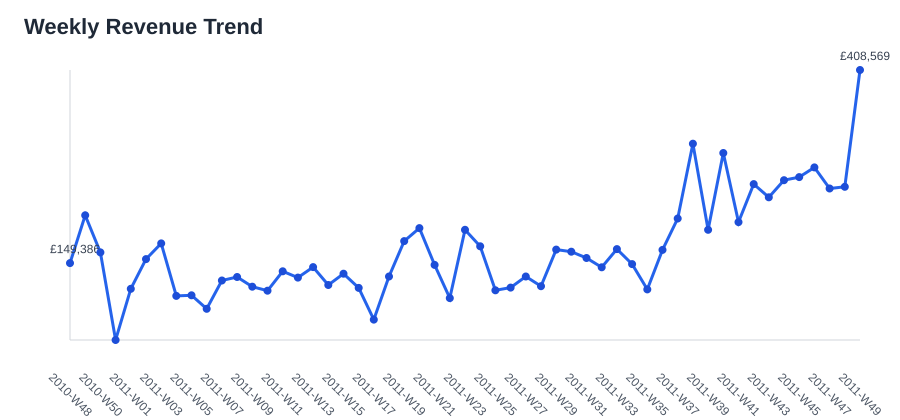
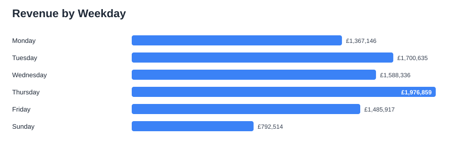
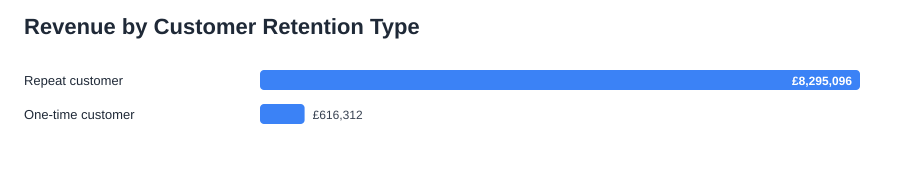

# E-commerce Sales Analysis with Python

This project analyzes transactional e-commerce sales data to identify revenue trends, top products, key markets, and high-value customers. The goal is to turn raw retail data into practical business insights for sales planning, inventory prioritization, and customer targeting.

## Business Questions

- How much revenue was generated after cleaning invalid transactions?
- Which months produced the strongest sales performance?
- Which products, countries, and customers contributed the most revenue?
- What actions could improve sales and retention?

## Dataset

The project uses the Online Retail dataset, containing invoices from a UK-based online retailer between December 2010 and December 2011.

Cleaning steps:

- removed missing product descriptions and customer IDs
- removed cancelled invoices
- removed zero or negative quantities
- removed zero or negative unit prices
- created a `Revenue` metric as `Quantity * UnitPrice`

## Key Results

| Metric | Value |
| --- | ---: |
| Total revenue | £8,911,408 |
| Completed transactions | 397,884 |
| Unique invoices | 18,532 |
| Unique customers | 4,338 |
| Unique products | 3,877 |
| Countries | 37 |
| Average order value | £481 |
| Revenue from repeat customers | 93.1% |

## Sales Seasonality Insights

Revenue shows a clear seasonal pattern. November 2011 was the strongest month with £1,161,817 in cleaned revenue, while February 2011 was the weakest full month with £447,137. The strongest sales week was 2011-W49, which generated £408,569.

By weekday, Thursday generated the most revenue at £1,976,859, while Sunday generated the least at £792,514. Saturday does not appear in the cleaned transaction data, so weekday interpretation should be treated as dataset-specific.

Detailed seasonality outputs are saved in `reports/tables/monthly_revenue.csv`, `reports/tables/weekly_revenue.csv`, `reports/tables/weekday_revenue.csv`, and `reports/tables/seasonality_summary.csv`.

## Data Quality Summary

The raw dataset contains 541,909 rows. After cleaning, 397,884 completed sales transactions remain for analysis, meaning 144,025 rows were removed or excluded from the main analysis.

Key quality checks:

| Check | Affected rows | Why it matters |
| --- | ---: | --- |
| Missing customer IDs | 135,080 | Customer segmentation and retention analysis require known customers. |
| Zero or negative quantity | 10,624 | These rows can represent returns or adjustments and distort sales revenue. |
| Cancelled invoices | 9,288 | Cancelled orders should not be counted as completed sales. |
| Exact duplicate rows | 5,268 | Duplicate rows may double-count transactions if not reviewed. |
| Missing product descriptions | 1,454 | Product-level analysis needs valid product descriptions. |
| Zero or negative unit price | 2,517 | Invalid prices distort revenue and average order value. |

Detailed checks are saved in `reports/tables/data_quality_summary.csv` and the cleaning funnel is saved in `reports/tables/cleaning_funnel.csv`.

## Visual Highlights

### Monthly Revenue Trend


### Weekly Revenue Trend



### Revenue by Weekday



### Top Products by Revenue


### Top Countries by Revenue


### Customer Retention



Repeat customers represent 65.6% of known customers but generate 93.1% of cleaned revenue. This suggests that retention, loyalty, and targeted communication are important business levers for this retailer.

## Business Recommendations

- Prioritize inventory planning around the highest-revenue products before seasonal demand peaks.
- Treat the United Kingdom as the core market and investigate growth opportunities in the next highest-revenue countries.
- Use high-value customer segments for retention campaigns, loyalty offers, or targeted communication.
- Monitor monthly revenue patterns to prepare stock, promotions, and staffing before peak periods.
- Protect repeat customers with loyalty campaigns because they contribute most of the revenue.
- Prepare inventory, promotions, and staffing before the November and early-December sales peak.

## Project Structure

```text
.
├── data/
│   └── OnlineRetail.csv
├── reports/
│   ├── figures/
│   ├── tables/
│   └── summary.md
├── src/
│   └── ecommerce_sales_analysis.py
├── sales-analysis.ipynb
└── README.md
```

## Tools Used

- Python
- pandas
- Jupyter Notebook
- SVG charts generated with Python standard library

## How to Run

Install dependencies:

```bash
pip install -r requirements.txt
```

Generate analysis outputs:

```bash
python src/ecommerce_sales_analysis.py
```

Or open `sales-analysis.ipynb` and run the cells in order.

## Author

Khadija Rezapoor
