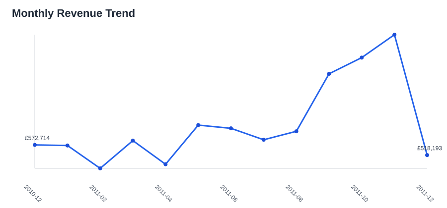
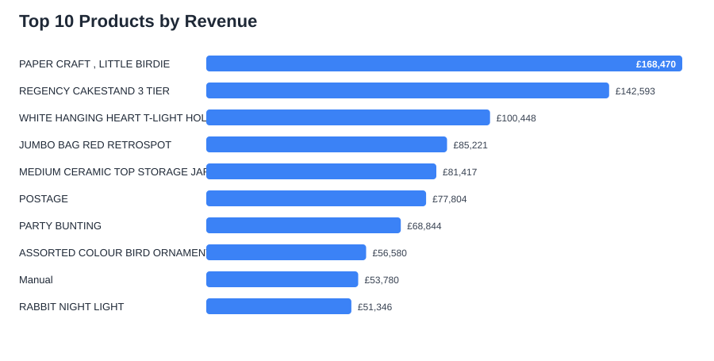
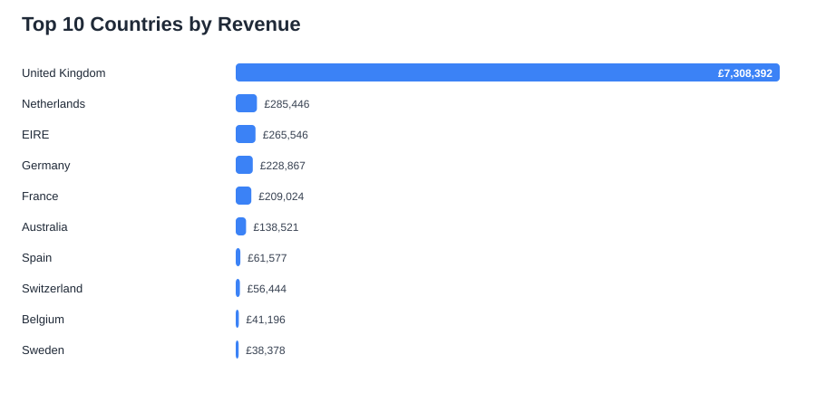

# E-commerce Sales Analysis with Python

This project analyzes transactional e-commerce sales data to identify revenue trends, top products, key markets, and high-value customers. The goal is to turn raw retail data into practical business insights for sales planning, inventory prioritization, and customer targeting.

## Business Questions

- How much revenue was generated after cleaning invalid transactions?
- Which months produced the strongest sales performance?
- Which products, countries, and customers contributed the most revenue?
- What actions could improve sales and retention?

## Dataset

The project uses the Online Retail dataset, containing invoices from a UK-based online retailer between December 2010 and December 2011.

Cleaning steps:

- removed missing product descriptions and customer IDs
- removed cancelled invoices
- removed zero or negative quantities
- removed zero or negative unit prices
- created a `Revenue` metric as `Quantity * UnitPrice`

## Key Results

| Metric | Value |
| --- | ---: |
| Total revenue | £8,911,408 |
| Completed transactions | 397,884 |
| Unique invoices | 18,532 |
| Unique customers | 4,338 |
| Unique products | 3,877 |
| Countries | 37 |
| Average order value | £481 |

## Visual Highlights

### Monthly Revenue Trend



### Top Products by Revenue



### Top Countries by Revenue



## Business Recommendations

- Prioritize inventory planning around the highest-revenue products before seasonal demand peaks.
- Treat the United Kingdom as the core market and investigate growth opportunities in the next highest-revenue countries.
- Use high-value customer segments for retention campaigns, loyalty offers, or targeted communication.
- Monitor monthly revenue patterns to prepare stock, promotions, and staffing before peak periods.

## Project Structure

```text
.
├── data/
│   └── OnlineRetail.csv
├── reports/
│   ├── figures/
│   ├── tables/
│   └── summary.md
├── src/
│   └── ecommerce_sales_analysis.py
├── sales-analysis.ipynb
└── README.md
```

## Tools Used

- Python
- pandas
- Jupyter Notebook
- SVG charts generated with Python standard library

## How to Run

Install dependencies:

```bash
pip install -r requirements.txt
```

Generate analysis outputs:

```bash
python src/ecommerce_sales_analysis.py
```

Or open `sales-analysis.ipynb` and run the cells in order.

## Author

Khadija Rezapoor
